<div align="center"> 
  
</div>

# 📊 DataInsideData™ — Financial Intelligence Lab (Flagship Project)

This project is the flagship system of the DataInsideData™ platform — a living demonstration of how modern builders combine data engineering, analytics, AI-assisted research, and transparent documentation into a cohesive, real-world intelligence environment.

**It represents the core philosophy of the brand**:

- build in public
- learn through experimentation
- design systems that turn raw data into insight, clarity, and community-ready knowledge.

> Part of the broader **DataInsideData™** platform ecosystem  
> A live analytics and AI research lab combining **data engineering, market analysis, structured experimentation, and AI-powered financial commentary**

**Fari Lindo • DataInsideData™**

**Role:** Technical Builder — Analytics, Data Engineering, AI Engineering, Systems Design, Documentation, and Platform Architecture

---

## Overview

The **Financial Intelligence Lab** is a flagship applied systems project within **DataInsideData™**.

It is designed to show how a modern builder can combine **analytics engineering, market research, artificial intelligence, structured experimentation, and technical publishing** into a coherent real-world platform.

Rather than presenting financial opinion as a black box, this project documents the underlying system:

- how data is collected  
- how portfolio and market observations are structured  
- how analytics are produced  
- how AI-generated commentary is grounded in validated inputs  
- how technical research can be published transparently for learning and portfolio storytelling  

This lab functions both as:

- a **live financial analytics environment**, and  
- a **portfolio-grade architecture case study** in modern data + AI system design

---

## Executive Summary

The **Financial Intelligence Lab** is a learning-driven analytics initiative inside **DataInsideData™**.

It explores how modern builders can combine:

- data science
- automation
- artificial intelligence
- analytics engineering
- portfolio observation
- structured publishing workflows

To better understand financial systems through transparent experimentation.

> This is not a financial advice product.

It is a **builder-focused research system** designed to document how modern data pipelines, analytics workflows, AI models, and publishing layers can work together to study complex market behavior.

---

## Domains Represented


---

## Implementation Stack


---

## Platform Philosophy

DataInsideData operates on three core principles:

- **Build in public**
- **Learn through experimentation**
- **Document systems transparently**

The Financial Intelligence Lab applies those principles to financial research.

Rather than presenting polished predictions, the lab shows how technical systems are built and used to:

- collect market and portfolio data
- structure research inputs
- generate analytics
- produce AI-assisted commentary
- publish findings as transparent technical artifacts

---

## What This Project Demonstrates

This repository demonstrates how to:

- analyze market data using Python
- track portfolio positions and research hypotheses
- separate capital invested from market gain
- generate AI-assisted daily commentary from structured data
- build reusable analytics pipelines
- produce charts and markdown research outputs
- connect research workflows to a broader publishing platform

Over time, this lab evolves from a portfolio tracker into a **mini financial intelligence platform** embedded inside the broader DataInsideData ecosystem.

---

## Current Implementation State

As of **March 2026**, the Financial Intelligence Lab has progressed from concept into an active analytics system.

### Implemented Components

- Portfolio snapshot tracking (daily asset-level data)
- Portfolio summary tracking (capital invested vs market performance)
- Market notes logging (macro, market, portfolio observations)
- Dividend tracking dataset
- Yahoo Finance historical backfill pipeline
- Merged multi-source analysis dataset
- Visualization layer (portfolio, sector, and performance charts)
- AI insight generation notebook and markdown output workflow

### Current Outputs

- Portfolio value over time
- Capital vs market performance tracking
- Market gain over time
- Sector-level equity trends
- Position weighting views
- Normalized asset performance comparisons
- Daily AI-generated financial commentary

This confirms the system has moved into the phase:

```text
DATA → PIPELINE → ANALYTICS → VISUALIZATION → AI
```

---

## Platform Ecosystem Context

The Financial Intelligence Lab is one subsystem inside the larger **DataInsideData™** platform, which is designed as a connected ecosystem spanning data, analytics, AI, publishing, and distribution.

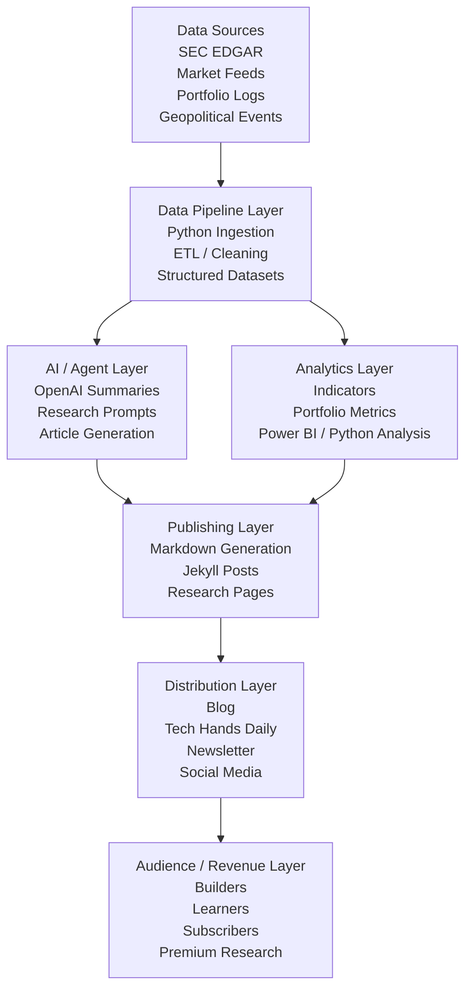

**Caption:** This diagram shows how DataInsideData operates as a multi-layer platform that transforms raw data into AI-assisted research, analytics, and educational content.

---

## Financial Intelligence Lab Architecture

Within that broader ecosystem, the Financial Intelligence Lab acts as a dedicated research and investing subsystem.

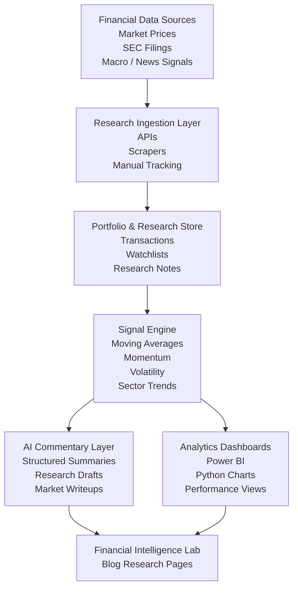

**Caption:** The Financial Intelligence Lab combines market data, research workflows, and AI-generated commentary to support disciplined learning, portfolio observation, and transparent experimentation.

---

## Core Project Architecture

At the current implementation level, the lab already follows a concrete working pipeline:

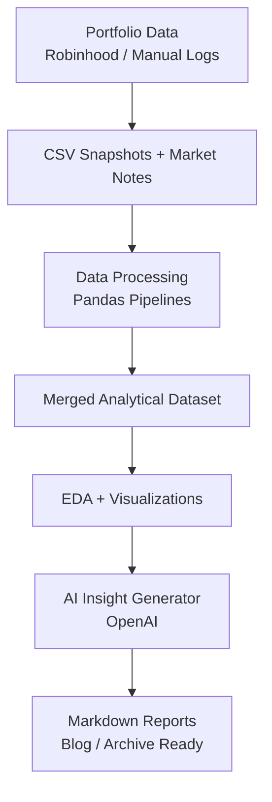

---

## AI News Agent Pipeline

One of the original strategic platform components is the **AI financial news / research agent**, designed as a reusable modular pipeline for turning public filings into readable research content.

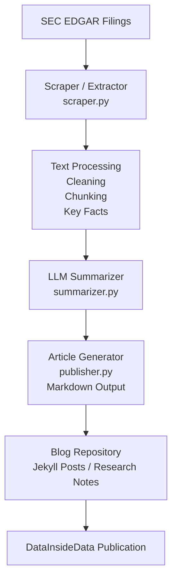

**Caption:** This pipeline shows how public filings can be transformed into readable research content through a modular AI-assisted workflow.

---

## Data Pipeline and Analytics Flow

The analytics engineering backbone of the platform is the pipeline that transforms raw inputs into validated, dashboard-ready outputs.

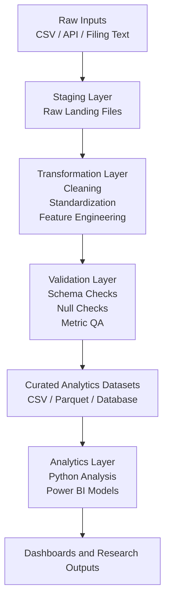

**Caption:** This diagram highlights the analytics engineering backbone of the platform, where raw data is standardized, validated, and turned into reporting-ready outputs.

---

## Publishing and Distribution Flywheel

The project is not only about analysis. It is also about turning technical work into educational content, research storytelling, audience growth, and future monetization opportunities.

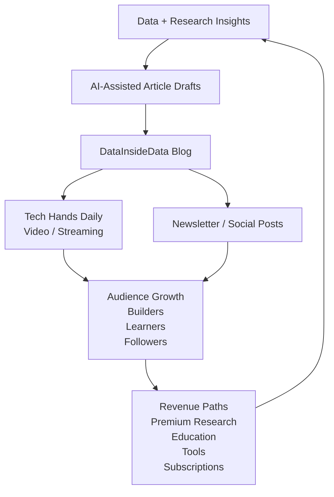

**Caption:** The platform is designed as a flywheel where research and technical builds generate content, content grows an audience, and audience growth supports future monetization.

---

## Technical Stack Summary

### Core Analytics
- Python
- Pandas
- NumPy
- Jupyter Notebooks
- Matplotlib

### Data Sources
- Yahoo Finance (`yfinance`)
- Manual portfolio snapshots
- Dividend tracking logs
- Market notes and macro observations
- Planned SEC EDGAR ingestion
- Planned geopolitical and market event layers

### AI Layer
- OpenAI API
- Structured prompt engineering
- Markdown report generation
- Daily commentary generation
- Blog-ready research drafting

### Platform / Delivery
- Git + GitHub
- Conda environment
- Modular notebook pipeline
- Markdown documentation
- Mermaid diagrams
- Planned Jekyll / GitHub Pages publication

---

## Project Structure

```text
FINANCIAL_INTELLIGENCE_LAB/
├── data/
│   ├── market/
│   └── portfolio/
│
├── processed/
│   ├── chart_tables/
│   └── portfolio_analysis_merged.csv
│
├── notebooks/
│   ├── 01_loaders_and_merge.ipynb
│   ├── 02_yahoo_backfill_and_prices.ipynb
│   ├── 03_merge_and_prepare_analysis.ipynb
│   ├── 04_visualizations.ipynb
│   └── 05_ai_insight_generator.ipynb
│
├── reports/
│   └── ai_generated/
│
├── docs/
│   ├── architecture/
│   ├── blog-ready/
│   └── planning/
│
├── assets/
│   ├── images/
│   └── diagrams/
│
└── README.md
```

---

## Key Concepts Implemented

The current implementation already demonstrates several important analytics engineering concepts:

- separation of **capital invested** from **market gain**
- time-series portfolio tracking
- sector bucketing and aggregation
- position weight analysis
- dividend tracking
- multi-source data integration
- normalized asset performance comparison
- structured AI-assisted financial interpretation

---

## Experimental Design

This project treats investing as a **data system**, not speculation.

Each step follows a research-oriented loop:

```bash
Hypothesis → Data Collection → Analysis → Interpretation → Iteration
```

---

## AI Insight Engine

The system generates structured daily portfolio commentary from:

- portfolio summary data
- merged analysis datasets
- sector-level performance views
- market and macro notes
- dividend observations

### Current AI Output Pattern

The AI commentary layer is designed to produce outputs such as:

- daily summary
- sector observations
- portfolio interpretation
- what to watch next

### Example Output Structure

```text
Daily Summary:
The portfolio expanded or contracted based on capital allocation and market movement.

Sector Observations:
Energy, tech, renewables, and income buckets are reviewed using sector equity and unrealized return context.

Portfolio Interpretation:
The system comments on concentration, diversification, relative stability, and short-term movement.

What to Watch Next:
Key sector and market signals to monitor in the next cycle.
```

### Output Location

```text
/reports/ai_generated/YYYY-MM-DD_daily_ai_commentary.md
```

### Public AI Access Concept

A future public-facing AI interface may be provided through a server-side endpoint with the following design rules:

- no direct API exposure in the client
- bounded prompt templates
- rate-limited access
- cost effective models for public interactivity
- stronger models reserved for internal publishing workflows

---

## Visual Outputs

The following analytics visuals are part of the current system. Placeholder paths are included below so the PNG files can be added cleanly into the repository without embedding them directly in this README.

### Portfolio Value Over Time
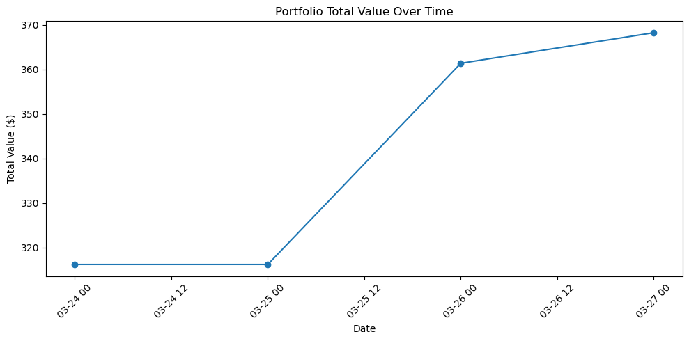

### Capital vs Market Performance
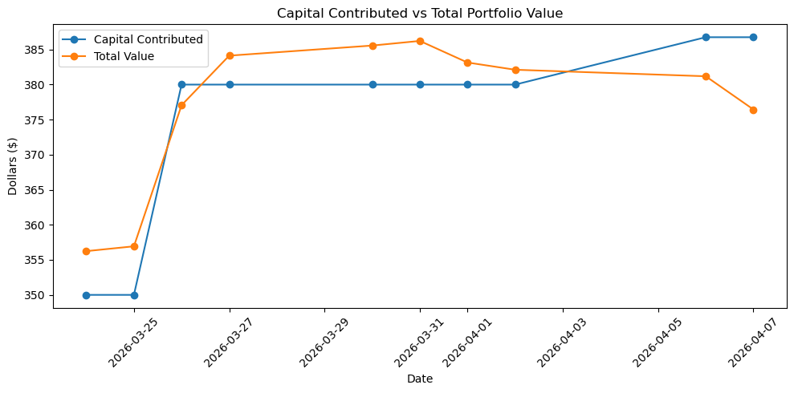

### Market Gain Over Time
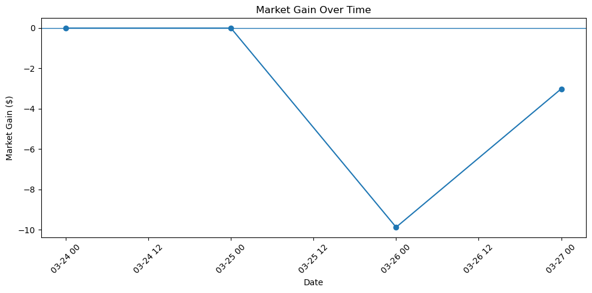

### Sector Equity Trends
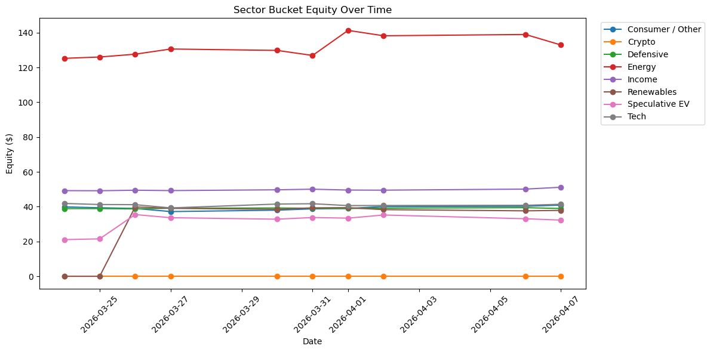

### Position Weights
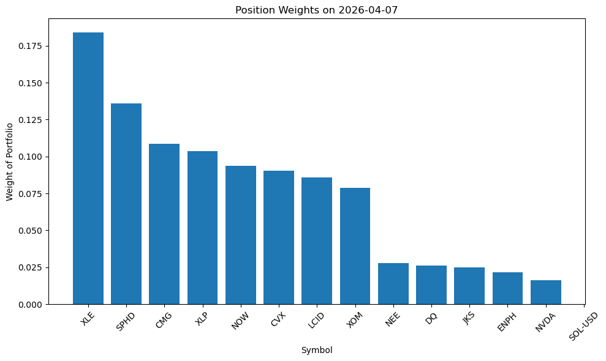

### Normalized Performance
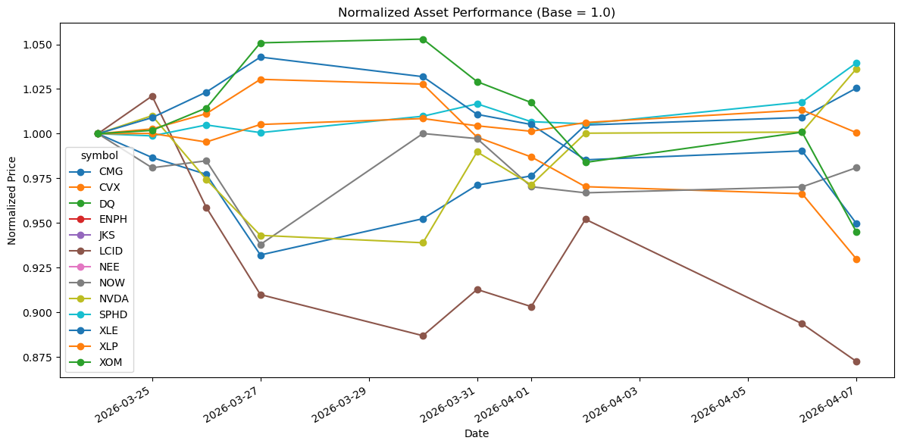

### Dividend Tracking
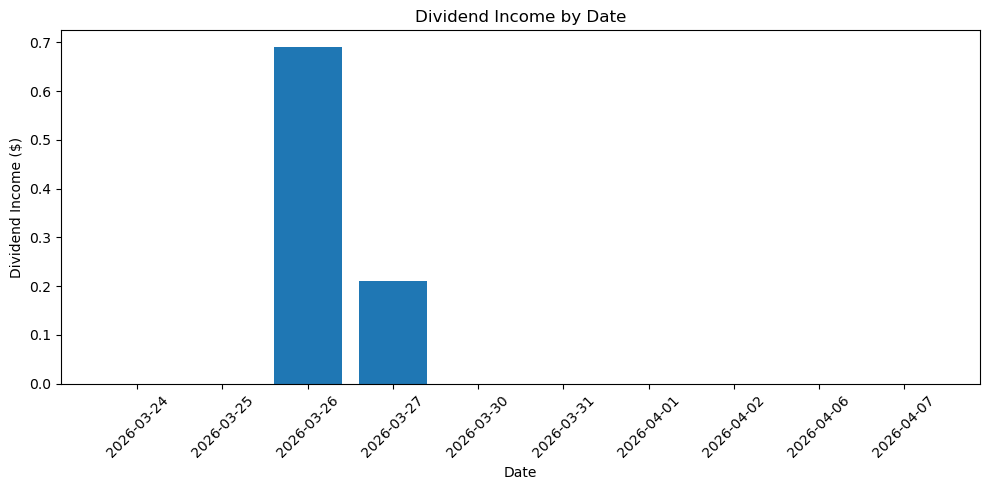

---

## AI Generated Summary

**Full report folder is here**:

[Daily AI Commentary](reports/ai_generated)

## Preview

```text
# Financial Intelligence Lab — AI Daily Commentary
## Date: 2026-03-25

## 1. Daily Summary
As of **2026-03-25**, the portfolio finished at **$356.93**, up **$6.93** on the day for a **1.98%** gain. This move reflects **market performance only**: there was **no new capital added** and **no capital deployed today**. Total contributed capital remains **$350.00**. Dividend income was **$0.00**.

## 2. Sector Observations
**Energy** was the clear leader, with **$126.02** in equity and **$6.02** of unrealized gain across **3 holdings**. The sector benefited from the day’s oil-related volatility noted in the data.

**Tech** also contributed positively, with **$41.25** in equity and **$4.70** of unrealized gain across **2 holdings**, suggesting a modest stabilization in the group.

Other positive but smaller contributors included:
- **Income:** $49.17 equity, $0.83 unrealized gain
- **Defensive:** $38.93 equity, $1.07 unrealized gain
- **Speculative EV:** $21.52 equity, $1.52 unrealized gain
- **Consumer / Other:** $39.38 equity, $0.62 unrealized gain

**Renewables** remained at **$0.00** equity despite **4 tracked names**, so it had no visible impact on portfolio value today.
```

---

## Example Learning Portfolio

The investment component is educational and used to support hands-on experimentation in data collection, analysis, and interpretation.

### Initial Allocation

| Category | Allocation |
|---|---:|
| Market Learning Portfolio | $200 |
| AI Platform Development | $50 |

### Example Energy Learning Positions

| Asset | Allocation |
|---|---:|
| XLE Energy ETF | $70 |
| Exxon Mobil | $30 |
| Chevron | $20 |

---

## Early Observations

Early analysis suggests several useful patterns:

- capital additions can strongly influence short-term portfolio movement
- energy holdings provided relative stability and stronger contribution
- renewable positions increased diversification but also volatility
- speculative positions showed higher short-term variance
- technology positions were more sensitive to broader market pressure

A key improvement in the project was the introduction of **capital vs market gain tracking**, which makes it possible to distinguish performance from simple cash additions.

---

## SDLC Mapping

This project is intentionally being developed with a dual lens:

1. **SDLC discipline**
2. **platform architecture thinking**

### Planning
- platform vision
- research scope
- monetization exploration
- system component planning

### Requirements
- AI-generated market summaries
- data ingestion pipelines
- portfolio tracking
- dashboards
- publishing workflows

### Architecture
- platform ecosystem diagrams
- financial intelligence lab architecture
- AI news agent pipeline
- data pipeline architecture
- publishing flow and distribution design

### Development
- AI news agent
- market analytics pipelines
- portfolio tracker
- markdown publishing scripts
- dashboards and visualizations

### Testing
- ingestion test points
- transformation QA checks
- data integrity validation
- AI output review
- dashboard consistency checks

### Deployment
- GitHub integration
- markdown publishing workflow
- blog publication path
- future automation hooks

### Iteration
- new datasets
- improved models
- enhanced dashboards
- expanded research content
- subscriptions / gated research / tools

---

## Recommended Build Order

To keep scope manageable, the platform is being developed in the following order:

1. AI News Agent Pipeline
2. Financial Intelligence Lab core tracker
3. Data pipeline and analytics outputs
4. Blog publishing workflow
5. Distribution and premium strategy layer

---

## Current Status

### Completed

- ✅ Portfolio tracking system
- ✅ Data ingestion pipeline
- ✅ Yahoo Finance historical backfill
- ✅ Merged analysis dataset generation
- ✅ Visualization layer
- ✅ AI insight generation notebook
- ✅ Markdown-based daily commentary workflow
- ✅ Initial architecture planning documents

### In Progress

- 🚧 Blog integration
- 🚧 Publishing workflow refinement
- 🚧 Broader repo structure planning
- 🚧 Automation and scheduled runs
- 🚧 Diagram refinement and draw.io conversion

### Planned

- signal engine expansion
- dashboard layer
- public AI access layer
- automated article generation
- distribution workflows
- premium research / builder education paths

---

## Future Expansion

### Phase 2 — Data Engineering Upgrade

- automated market data ingestion
- structured datasets
- stronger analytics pipelines

### Phase 3 — AI Analytics Layer

- improved summarization models
- trend detection systems
- anomaly detection
- automated research note generation
- multi-tone output modes

### Phase 4 — Interactive Analytics

- dashboards
- research tools
- strategy simulators
- user-triggered exploration layers

---

## Publishing and Blog Integration

The Financial Intelligence Lab is intended to appear as a dedicated research section inside the broader DataInsideData platform.

Possible navigation structure:

- Market Signals
- Energy Sector Tracker
- Portfolio Learning Log
- AI Market Reports

Each section is intended to document both:

- technical implementation
- research findings

This keeps the project valuable both as a technical portfolio artifact and as a public learning system.

---

## Long-Term Revenue Paths

Revenue is a future-layer concern, not the core purpose of the project.

Potential paths include:

### Premium Research
Paid access to deeper reports, datasets, and dashboards

### Builder Education
Courses and tutorials on how to build:
- AI agents
- analytics pipelines
- automated research systems

### Analytics Tools
Access to:
- signal monitoring tools
- dashboards
- automation workflows

### Newsletter / Community
Free and premium tiers for:
- research summaries
- deeper notes
- curated datasets

---

## Educational Philosophy

The Financial Intelligence Lab is not just about markets.

It is also about learning how modern data systems can be built to observe, organize, and explain complex environments.

The initiative embraces an open learning philosophy:

- experiment openly
- document processes transparently
- share what works
- share what fails
- improve the system through iteration

The goal is not prediction theater.

The goal is to build analytical thinking, technical discipline, and real systems understanding.

---

## About

Built by **Fari Lindo** under **DataInsideData™**

**Tech Hands, a Science Mind, and a Heart for Community™**

This project reflects a core philosophy:

> Learn systems by building and observing them in motion.

---

## Contact

### Fari Lindo • DataInsideData™

- [GitHub](https://github.com/dataeden)
- [Portfolio](https://datainsidedata.com)
- [LinkedIn](https://www.linkedin.com/in/fari-lindo/)
- [Email](mailto:contact@datainsidedata.com)

---

**Data Inside Data™**  
*Tech Hands, a Science Mind, and a Heart for Community™*
